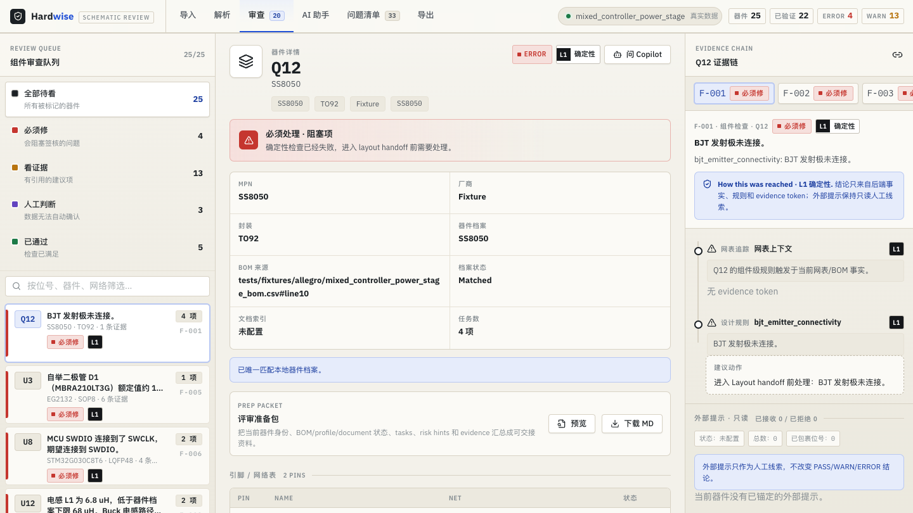
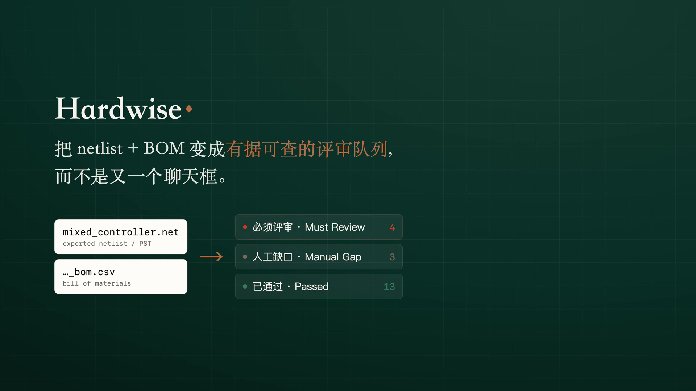

# Hardwise

[English](README.md) | [中文](README.zh-CN.md)

**[▶ Open the live workbench demo](https://liwenjinchn.github.io/hardwise/hardware-demo.html)** — an
offline snapshot of the review workbench, straight in the browser: review
queues, deterministic findings with evidence tokens, and an audited Copilot
transcript.

[](https://liwenjinchn.github.io/hardwise/hardware-demo.html)

> A trusted pre-layout schematic-review workbench for public hardware projects:
> review queues, evidence-backed findings, registry-verified refdes, and
> deterministic validation.

**Why it matters:** schematic review is evidence-heavy manual work before
Layout; Hardwise turns exported netlist+BOM files into a bounded review
queue instead of an ungrounded chatbot.

**What I built:** a local AI-assisted workbench with deterministic validators,
registry-verified reference designators, datasheet/document coverage, and
tool-backed Copilot traces.

**Proof:** public fixtures, a clickable offline SPA demo, GitHub Actions CI,
and a 687-test regression suite covering refdes guards, evidence filtering,
workbench APIs, CLI flows, and report exits.

Pre-layout schematic review still runs on manual labor: cross-checking
reference designators, digging through datasheets, and assembling evidence for
every finding before a board goes to Layout. Hardwise targets that single
node. It does not claim that an LLM can independently judge a complete
hardware design. It proves a narrower and more useful engineering loop:
import a public schematic project or schematic netlist+BOM, build a trusted
component registry, run deterministic review checks, separate hard findings from
manual/profile gaps, attach evidence tokens, and let the agent explain only
tool-backed facts. Scope is bounded on purpose: a two-week MVP covering the
pre-layout schematic-review node only.

Architecture is inspired by [Wrench Board](https://github.com/Junkz3/wrench-board) (Anthropic *Build with Opus 4.7* hackathon, 2nd place, April 2026). Design ideas only, no code copied.

Built with AI assistance. All design decisions and final code are reviewed and owned by the author.

---

## Resume bullet

Built **Hardwise**, a local AI-assisted schematic review workbench that imports
netlist+BOM files, runs deterministic hardware validators, prevents
hallucinated reference designators, and surfaces evidence-backed review queues
with tool-traced Copilot explanations and 687-test regression coverage.

---

## Demo

**▶ 50-second product tour** — the problem, the anti-hallucination core (Refdes Guard + Evidence Ledger), the live workbench, and the trust tiers. Click the poster to play:

[](https://github.com/liwenjinchn/hardwise/raw/main/docs/assets/hardwise-promo.mp4)

Two ways in, no setup for either:

- **Demo video (~90 s):** [hardwise-demo.mp4](https://github.com/liwenjinchn/hardwise/releases/download/demo-video/hardwise-demo.mp4)
- **Live workbench:** [hardware-demo.html](https://liwenjinchn.github.io/hardwise/hardware-demo.html) — the offline SPA snapshot, click around straight in the browser

GitHub shows HTML files as source. Open the rendered GitHub Pages demos for the intended reading view:

- **Reading index:** [https://liwenjinchn.github.io/hardwise/](https://liwenjinchn.github.io/hardwise/)
- **Product intro:** [https://liwenjinchn.github.io/hardwise/product-intro.html](https://liwenjinchn.github.io/hardwise/product-intro.html)
- **Offline SPA workbench snapshot:** [https://liwenjinchn.github.io/hardwise/hardware-demo.html](https://liwenjinchn.github.io/hardwise/hardware-demo.html)
- **MVP definition:** [https://liwenjinchn.github.io/hardwise/mvp_definition.html](https://liwenjinchn.github.io/hardwise/mvp_definition.html)
- **Technical snapshot:** [https://liwenjinchn.github.io/hardwise/demo.html](https://liwenjinchn.github.io/hardwise/demo.html)
- **Recording script:** [https://liwenjinchn.github.io/hardwise/demo_recording_script.html](https://liwenjinchn.github.io/hardwise/demo_recording_script.html)
- **Docs inventory:** [https://liwenjinchn.github.io/hardwise/docs_inventory.html](https://liwenjinchn.github.io/hardwise/docs_inventory.html)

Local quickstart:

```bash
uv sync
./scripts/start_hardwise_workbench.command
uv run hardwise design-validator-ui tests/fixtures/allegro/mixed_controller_power_stage.net tests/fixtures/allegro/mixed_controller_power_stage_bom.csv --ai-snapshot --document-index data/document_indexes/mixed_controller_power_stage_docs.csv --output /tmp/hardwise-copilot-workbench.html
```

On Windows, double-click `scripts/start_hardwise_workbench.cmd`. Both launchers
load the built-in demo project, open `http://127.0.0.1:8765/`, and keep the
Import tab available for replacing the netlist/PST and BOM.

KiCad `review` / `ask` commands are kept below as evidence-chain appendix and
reproduction commands.

## MVP product loop

Hardwise is shaped around the review meeting before Layout handoff:

```text
import schematic/netlist+BOM
  -> build registry-verified component table
  -> run deterministic checks and profile validators
  -> split output into Must Review / Manual Gap / Passed
  -> explain findings through tool-backed Copilot traces
  -> export a review feedback list with evidence
```

The workbench should answer the reviewer's first questions before it teaches the
architecture: what needs attention, what is only a manual gap, what passed, and
which source token supports each row. See [`docs/mvp_definition.md`](docs/mvp_definition.md)
for the durable MVP boundary: user problem, core flow, page structure, scope,
non-goals, and acceptance criteria.

If you are unsure whether a document is current or historical, use
[`docs/docs_inventory.md`](docs/docs_inventory.md) as the reading map.

## What the MVP proves

The current implementation proves this review loop through **five trust mechanisms**
and visible **L1/L2/L3 trust tiers**. The canonical public runbook is the
local React workbench served by `serve-workbench --fake-ai`, with the same SPA
appearance available as an offline `design-validator-ui --ai-snapshot` snapshot.
KiCad review/ask commands remain as an evidence-chain appendix for reproducing
registry, L78 retrieval, and agent-tool behavior.

Action labels in the product map to the trust tiers:

| Review action | Meaning | Trust tier |
|---|---|---|
| **Must Review** | Deterministic ERROR/WARN or high-value checklist finding that should be discussed before Layout. | Usually L1 |
| **Manual Gap** | No ready profile, no retrieval evidence, or not enough schematic context; keep it visible for reviewer judgement. | L3 |
| **Passed** | Deterministic check completed without an issue. | L1 |
| **Evidence Question** | Copilot can cite a page-level datasheet hit for inspection, but it does not create a hard validator verdict. | L2 |

| Mechanism | What it proves in the demo |
|---|---|
| Refdes Guard | User-visible refdes-like tokens must come from the parsed EDA registry, or they are wrapped before display. |
| Evidence Ledger | Report findings need source tokens such as `sch:<file>#<refdes>`, `datasheet:<pdf>#p<N>`, or `rule:<id>`. |
| Sleep Consolidator | Repeated findings become human-gated candidate rules, not auto-enabled model output. |
| Tiered Model Routing | Runtime model slots are selected by env tier (`fast` / `normal` / `deep`), not hard-coded model names. Maturity: placeholder slot structure; there is no query-level routing policy yet. |
| Prompt Caching | The static agent prompt is wired as cacheable and usage accounting is tested. Maturity: cache-read was measured on the configured Anthropic-format proxy; true provider cache behavior is external measurement, not a CI assertion. |

| Trust tier | Meaning | Where it appears |
|---|---|---|
| **L1 deterministic** | Python rules / validators produce the PASS/WARN/ERROR truth. The model may explain it, but does not decide it. | Component validation rows, `run_component_validation`, static workbench. |
| **L2 grounded** | A datasheet search turn surfaced page-level retrieval evidence for reviewer inspection. This is not sentence-level entailment. | L78 trace: `datasheet:l78.pdf#p4`; U12/XL1509 workbench trace: `datasheet:xl1509.pdf#p11` and `datasheet:xl1509.pdf#p9`. |
| **L3 manual** | No ready profile or no retrieval evidence is present; the system keeps the row/question in human-review territory. | No-profile workbench rows, no-hit datasheet questions. |

The coverage loop is supporting evidence: Hardwise ranks profile gaps, then moves selected public-evidence groups from L3/manual rows into L1 deterministic rows one family at a time. That proves the loop is repeatable, but the headline remains trust: the model is bounded by registry objects, evidence tokens, deterministic validators, and structured tool returns.

The demo main stage is the exported-netlist workbench. For a live local run
with the real Copilot path, use the launcher:

```bash
./scripts/start_hardwise_workbench.command
```

For deterministic recording without an API key, run the fake-agent server:

```bash
uv run hardwise serve-workbench \
  tests/fixtures/allegro/mixed_controller_power_stage.net \
  tests/fixtures/allegro/mixed_controller_power_stage_bom.csv \
  --document-index data/document_indexes/mixed_controller_power_stage_docs.csv \
  --fake-ai \
  --port 8765
```

For a public/offline fallback with the same SPA shell:

```bash
uv run hardwise design-validator-ui \
  tests/fixtures/allegro/mixed_controller_power_stage.net \
  tests/fixtures/allegro/mixed_controller_power_stage_bom.csv \
  --ai-snapshot \
  --document-index data/document_indexes/mixed_controller_power_stage_docs.csv \
  --output reports/controller-workbench.html \
  --index-output reports/controller-design-validator-index.md \
  --index-json reports/controller-design-validator-index.json
```

Both paths consume an exported schematic netlist/PST plus BOM, auto-match
public datasheet profiles by BOM identity, and render the review workbench.
`--document-index` feeds a reviewed public datasheet-link CSV; each component
then shows a document coverage status — `document_index_matched` in prose
(`matched` in the machine-readable index: one reviewed public link),
`no_result` (no reviewed link yet, an honest coverage gap), `ambiguous`
(several candidate rows need a reviewer pick), or `manual_needed` (the BOM
identity is unusable for matching) — and a document-index match proves
document coverage only, never an electrical verdict. The
offline snapshot is a single HTML file with baked state, component details,
exports, prep packets, and audited Copilot responses; the live server exposes
the same facts through local `/api/workbench/*` endpoints. What the workbench proves is the
deterministic trust path, not a coverage trophy: U1/L7805 repeats the L78
evidence path in the workbench, while U12/XL1509, U3/EG2132, U8/STM32G030, and
Q12/SS8050 show deterministic topology, debug-interface, or profile-pin errors.
The mixed controller fixture reports 25 components, 22 validated rows,
bom_rows_matched=25,
PASS/WARN/ERROR = 5/13/4, and 3 manual/no-local-profile rows. The 22 L1 rows
are 9 profile-backed targets (U1/U12/U3/U8, D1/D5, and Q1/Q2/Q12) plus 13
generic passive checks; the passive checks are light deterministic coverage
for explicit BOM/netlist facts, not deep datasheet review.

Use this screen order for the canonical recording:

| Beat | Show | Claim |
|---|---|---|
| Project summary | Top metrics and grouped review queue. | The input has been turned into a review workbench, not a chat transcript. |
| Must Review | The Must Review section. | Deterministic ERROR/WARN rows stay visible before Layout handoff. |
| `U12` deterministic ERROR | Open the XL1509 detail. | The buck issue comes from validator truth over netlist + profile facts. |
| Copilot trace | Expand a Copilot Evidence / Tool trace. | The agent explains structured tool results; it does not decide PASS/WARN/ERROR. |
| `U999` wrapped | Ask whether the board has `U999`. | Unknown refdes return structured misses and display as `⟨?U999⟩`. |
| L78 evidence token | Show `datasheet:l78.pdf#p4` in the L78 trace. | Page-level retrieval/profile evidence is visible and bounded as L2 grounded evidence. |

`serve-workbench --fake-ai` drives the real agent loop with a deterministic fake
client; real mode talks to any Anthropic-format endpoint configured in `.env`.
`design-validator-ui --ai-snapshot` bakes audited offline chat responses into
the single HTML file (no server, no API key). Every panel answer uses the same
Runner tool surface — 5 core query tools plus 7 context/topology tools at
workbench runtime, about 12 tools total — and the same Refdes Guard, so an
unknown refdes such as `U999` is wrapped as `⟨?U999⟩` rather than fabricated.

If a project has zero local profile matches, the same command still emits a
coverage/gap workbench plus optional markdown / JSON index sidecars instead of
inventing validation results.

The KiCad path is the evidence-chain appendix:

```bash
$ uv run hardwise review data/projects/pic_programmer --rules R001,R002,R003,DS001 --report-style component
report: reports/pic_programmer-YYYYMMDD.md (29 findings, 121 components reviewed)
store:  reports/pic_programmer.db (121 components, 77 NC pins)
```

On the public KiCad demo project `pic_programmer`, Hardwise runs deterministic
schematic-review rules:

- R001: new-component candidate check
- R002: capacitor rated-voltage field completeness
- R003: NC-pin handling, with connector/socket aggregation
- DS001: L78 regulator Vin absolute-maximum evidence check

The current sample report has **29 findings**: 6 R002 capacitor-voltage-field findings, 22 R003 NC-pin findings after noise reduction, and one DS001 `U3` / L7805 finding that cites the reviewed profile token `datasheet:l78.pdf#p4`. DS001 stays `reviewer_to_confirm` because the current schematic path cannot infer the applied Vin rail; it does not guess. Each finding carries a source token; NC pins are coordinate-matched from KiCad `no_connect` markers rather than model-generated.

The L78 and XL1509 paths have live retrieval smokes. L78 ingests `l78.pdf`,
then `query-datasheet "absolute maximum input voltage"` returns
`[l78.pdf p4 part=L7805]`, and `hardwise ask ... --vector` calls
`search_datasheet` before citing page 4. XL1509 ingests the public XLSEMI PDF
as `xl1509.pdf`; targeted workbench turns for U12 return page-level evidence
including `datasheet:xl1509.pdf#p11` for the 12 V application / 68 uH inductor
and `datasheet:xl1509.pdf#p9` for the Schottky diode table. See
[`docs/evidence_chain_audit.md`](docs/evidence_chain_audit.md). Other profile
tokens are reviewed public profile evidence unless their PDFs have also been
staged and queried.

Public/synthetic pressure-fixture imports are coverage-planning evidence, not the primary public demo. The closeout rerun reports Switch fixture 4010 components / 3794 validated / 216 manual / PASS/WARN/ERROR = 3663/125/6, and mainboard fixture 8180 components / bom_rows_matched=7248 / 6847 validated / 1333 manual / PASS/WARN/ERROR = 3921/2926/0. See [`docs/closeout_pressure_summary.md`](docs/closeout_pressure_summary.md); the movement came from conservative generic inductor/ferrite coverage plus the reviewed PE537BA P-MOS profile, not from a full-board automatic correctness claim.

For repeated component families, Hardwise can draft `needs_review` profile
skeletons from reusable archetypes such as `74x165_piso_16pin`. See
[`docs/profile_archetypes.md`](docs/profile_archetypes.md). Drafts are ignored
by automatic validation until a reviewer promotes them to `ready`.

The public eval pack adds a wider smoke path:

```text
5 public repos / 6 component-bearing KiCad project directories
1707 parsed components
437 deterministic findings
0 project failures
10 empty KiCad directories skipped
0 unverified refdes wrapped
0 findings dropped for missing evidence
```

These are regression and reproducibility metrics, not expert gold-label accuracy claims.

## What it is

Hardwise is a design-validation assistant for the early hardware R&D node before PCB layout. It turns public EDA projects and public datasheets into review artifacts with two hard constraints:

1. Every reference designator shown to the user must come from the parsed EDA registry.
2. Every report finding must carry a source token such as `sch:<file>#<refdes>`, `datasheet:<pdf>#p<N>`, or `rule:<id>`.

It is designed around a practical anti-hallucination stance: first make the agent unable to invent board objects, then let it help organize review attention.

## What it is not

- Not a PCB layout, SI/PI, EMC, or thermal simulator
- Not a PLM or production BOM management system
- Not a real-time Cadence/Allegro plugin; it consumes exported netlist/PST+BOM artifacts offline or through a local server
- Not a board repair tool; Wrench Board is the reference project for that domain
- Not a production product; this is a portfolio MVP

All demo inputs are public. No company-internal hardware data is used.

## Core Proof

Hardwise's main claim is narrow: **the model is not allowed to invent board objects or silently upgrade weak evidence into hard findings**. The MVP proves that claim with five implemented mechanisms:

| # | Mechanism | What it does | Status |
|---|-----------|--------------|--------|
| 1 | **Refdes Guard** | User-visible refdes-like tokens (`U1`, `R10`, `J5`) must hit the parsed EDA registry; unknowns are wrapped before output. | Live: `src/hardwise/guards/refdes.py` |
| 2 | **Evidence Ledger** | Findings without evidence tokens are dropped. No token, no claim. | Live: `src/hardwise/guards/evidence.py` |
| 3 | **Sleep Consolidator** | Repeated findings are recorded as human-gated candidate rules before they can become new deterministic checks. | Live: `src/hardwise/memory/consolidator.py` |
| 4 | **Tiered Model Routing** | The agent chooses `fast` / `normal` / `deep` slots from env config; code does not hard-code a vendor model. | Live: `src/hardwise/agent/router.py`; maturity: placeholder slot structure, no query-level routing policy yet. |
| 5 | **Prompt Caching** | The static prompt is sent with `cache_control`, and usage accounting tracks create/read tokens. | Live: `src/hardwise/agent/prompts.py`, `src/hardwise/agent/runner.py`; maturity: wiring + accounting are tested offline, true cache-read remains external provider measurement. |

The agent surface is tiered in the same vocabulary used by validation details: `L1 deterministic`, `L2 grounded`, and `L3 manual`. `run_component_validation` is L1 and can affect PASS/WARN/ERROR. `search_datasheet` becomes L2 only when a turn returns page-level retrieval evidence such as `datasheet:l78.pdf#p4` or `datasheet:xl1509.pdf#p11`. No profile, no retrieval, or no configured vector store stays L3 and requires reviewer confirmation.

## Quickstart

```bash
git clone <repo> hardwise
cd hardwise
uv sync
cp .env.example .env  # fill in ANTHROPIC_API_KEY for API-backed commands
```

The repository ships with a public KiCad sample under `data/projects/pic_programmer/`. Local inspect/review commands work after `uv sync`; API commands require `.env`.

On Windows, use the PowerShell commands in [`docs/windows.md`](docs/windows.md).
Native Windows is expected to work for the main CLI and local workbench paths,
but treat it as CI-verified only after the `windows-latest` workflow passes for
the commit you are using.

### Review a schematic

```bash
uv run hardwise review data/projects/pic_programmer --rules R001,R002,R003,DS001 --report-style component
uv run hardwise review data/projects/pic_programmer --rules R001,R002,R003 --format html
```

Produces:

```text
report: reports/pic_programmer-YYYYMMDD.md   (29 findings, 121 components reviewed with DS001)
report: reports/pic_programmer-YYYYMMDD.html (28 finding R001/R002/R003 visual report with --format html)
store:  reports/pic_programmer.db            (121 components, 77 NC pins)
consolidator: 3 candidate rule(s) appended to memory/rules.md
trace:  reports/trace.jsonl                  (append-only run ledger)
```

### Ask the schematic through tools

```bash
uv run hardwise ask data/projects/pic_programmer "U4 has how many NC pins?"
uv run hardwise ask data/projects/pic_programmer "What is U999?"
```

The runtime agent surface is 5 core query tools plus 7 context/topology tools
(about 12 tools total). The core query tools are `list_components`,
`get_component`, `get_nc_pins`, `search_datasheet`, and
`run_component_validation`; the workbench adds parsed topology, document
coverage, and reviewed-profile evidence locator tools. Unknown objects return
structured misses such as `found=false` plus closest matches; validation without
a loaded design or profile returns `not_configured` / `no_profile` instead of a
fabricated verdict.

### Workbench with Copilot panel

```bash
# Offline single-file SPA snapshot (no server, no API key):
uv run hardwise design-validator-ui \
  tests/fixtures/allegro/mixed_controller_power_stage.net \
  tests/fixtures/allegro/mixed_controller_power_stage_bom.csv \
  --ai-snapshot --document-index data/document_indexes/mixed_controller_power_stage_docs.csv \
  --output reports/controller-workbench.html

# Local live server (deterministic fake model, no API key):
uv run hardwise serve-workbench \
  tests/fixtures/allegro/mixed_controller_power_stage.net \
  tests/fixtures/allegro/mixed_controller_power_stage_bom.csv \
  --document-index data/document_indexes/mixed_controller_power_stage_docs.csv \
  --fake-ai --port 8765
```

Both render the same SPA review workbench. The offline snapshot bakes state,
component details, exports, prep packets, and audited chat responses into the
HTML; the live server exposes `POST /api/workbench/chat`. `--fake-ai` drives the
real agent loop (real tools, real Refdes Guard) without an API key; drop it and
set `.env` to use a live Anthropic-format model. Every answer carries a
collapsed evidence/tool trace, and unverified refdes are wrapped before display.

### Datasheet ingest and semantic search

```bash
# Drop a public datasheet into data/datasheets/ first.
# For the ST resource URL, save CD00000444.pdf locally as l78.pdf.
uv run hardwise ingest-datasheet data/datasheets/l78.pdf --part-ref L7805
uv run hardwise query-datasheet "absolute maximum input voltage" --top-k 3

# After ingesting relevant public datasheets:
uv run hardwise review data/projects/pic_programmer --rules R003 --vector
```

Datasheet chunks carry provenance such as `[l78.pdf p4 part=L7805]` and `[xl1509.pdf p11 part=XL1509-12E1]`, which independently corroborate structured profile tokens such as `datasheet:l78.pdf#p4` and `datasheet:xl1509.pdf#p11`. Rules such as DS001 and component validation read the reviewed profile JSON; they do not scrape Chroma text during `review`.

Current evidence-chain boundary: L78 and XL1509 have been smoke-tested through `ingest -> retrieve -> agent/workbench citation`. The remaining profile JSON files are reviewed deterministic inputs, not proof that every profile fact was retrieved live from Chroma.

### Run the eval pack

```bash
uv run hardwise eval --download
uv run hardwise eval --limit-projects 1
uv run hardwise eval --static-snapshot
```

Outputs:

- `reports/eval/eval-summary.json`
- `reports/eval/eval-summary.html`

The eval gate is intentionally narrow for the MVP: fail on parser/project failures, new unverified refdes wrapping, or newly dropped evidence-less findings. Finding-count changes are reported as observations because useful rule changes can legitimately add or remove findings. `--static-snapshot` writes the accepted offline headline snapshot (1707 parsed components / 437 deterministic findings) when a demo environment should not depend on live GitHub checkouts.

### Use PostgreSQL instead of SQLite

The relational store uses SQLAlchemy 2.0. Default is SQLite (`reports/<project>.db`); set `HARDWISE_DB_URL` for PostgreSQL or MySQL.

```bash
uv sync --extra postgres
export HARDWISE_DB_URL="postgresql+psycopg2://<user>@<db-host>:5432/hardwise"
uv run hardwise review data/projects/pic_programmer --rules R001,R002,R003
```

## Prompt cache verification

`hardwise ask` reports token accounting from the Anthropic-format `usage` object.

Latest live cold-start probe on 2026-05-16 used the configured MiMo Anthropic-format proxy (`mimo-v2.5`) with a unique cacheable system prompt:

| Run | Input/output tokens | Cache create/read | Result |
|---|---:|---:|---|
| 1 | 5445 / 16 | `null` / `null` | cold prompt billed as normal input |
| 2 | 5 / 16 | `null` / **5440** | same prompt immediately hit cache |

MiMo demonstrably serves cached prompt reads (`cache_read_input_tokens` nonzero), but this endpoint currently leaves `cache_creation_input_tokens` null. Strict creation-accounting verification needs another Anthropic-format endpoint that exposes that field.

## Architecture

See [`docs/architecture.md`](docs/architecture.md). The EDA boundary uses an
adapter pattern (`src/hardwise/adapters/`): the current workbench consumes
exported Allegro-style netlist/PST+BOM artifacts, while live in-tool
Cadence/Allegro plugin integration remains outside the MVP.

## MVP Boundary

Current MVP status:

| Slice | Status | Highlights |
|---|---|---|
| 0 — Frame | Done | Review-node profile, sprint plan, JD alignment |
| 1 — R001 + Guards | Done | Finding model, Refdes Guard, Evidence Ledger |
| 2 — R002 + Consolidator | Done | Capacitor-voltage-field check, candidate-rule memory |
| 3 — R003 + Dual Store + Router | Done | NC-pin parser, SQLite/Chroma, datasheet ingest, tiered routing |
| 4 — Agent Loop + Prompt Caching | Done | `hardwise ask`, structured tools, live prompt-cache read hit |
| 5 — Submission Closeout | Done | Canonical workbench demo narrative, README/demo/docs closeout, final artifacts |
| Workbench — Allegro Copilot | Done | `serve-workbench` live agent loop + `design-validator-ui --ai-snapshot` offline; reuses the 5-core + 7-context runtime tool surface and Refdes Guard |

The MVP intentionally stops here. R004/R005-style net-aware checks, a
schematic-side net parser, a human-labeled calibration set, Windows CI result
follow-up, and live Cadence/Allegro plugin integration are explicitly post-MVP.
The current submission story is not "more rules"; it is a constrained
design-validation workbench with registry-verified objects and evidence-gated
findings.

## FAQ

See [`docs/faq.md`](docs/faq.md) for concise answers to the six recurring technical questions about this project's design choices.

## License

MIT. See [`LICENSE`](LICENSE).

## Acknowledgements

- [Wrench Board](https://github.com/Junkz3/wrench-board) for architectural inspiration.
- KiCad open-source ECAD project for public sample inputs.
- Anthropic for the Anthropic-format API protocol and Python SDK.
- MiMo (Xiaomi) for the `mimo-v2.5` upstream used through an Anthropic-compatible proxy.
