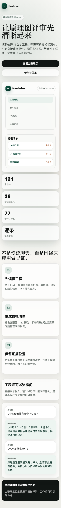

# Hardwise

[English](README.md) | [中文](README.zh-CN.md)

> A guardrailed schematic-review pipeline for public KiCad projects: registry-verified refdes, evidence-gated findings, and a tool-use agent query path.

Hardwise is a two-week portfolio MVP for the **pre-layout schematic review** node in hardware R&D. It does not claim that an LLM can independently judge a complete hardware design. It proves a narrower and more important engineering loop: parse a public EDA project, run review rules, force every surfaced refdes through the parsed registry, attach evidence tokens to every finding, and let the agent answer schematic questions only through structured tools.

Architecture is inspired by [Wrench Board](https://github.com/Junkz3/wrench-board) (Anthropic *Build with Opus 4.7* hackathon, 2nd place, April 2026). Design ideas only, no code copied.

Built with AI assistance. All design decisions and final code are reviewed and owned by the author.

---

## Resume demo

If you only have 90 seconds, start here:

[](https://liwenjinchn.github.io/hardwise/product-intro.html)

GitHub shows HTML files as source. Use the screenshot above for a quick scan, or open the rendered GitHub Pages demos:

- **Product intro:** [https://liwenjinchn.github.io/hardwise/product-intro.html](https://liwenjinchn.github.io/hardwise/product-intro.html)
- **Hardware demo:** [https://liwenjinchn.github.io/hardwise/hardware-demo.html](https://liwenjinchn.github.io/hardwise/hardware-demo.html)
- **Technical snapshot:** [`docs/demo.html`](docs/demo.html)
- **Short read:** [`docs/demo.md`](docs/demo.md)
- **Reproduce locally:** `uv run hardwise review data/projects/pic_programmer --rules R001,R002,R003 --format html`

## What the MVP proves

```bash
$ uv run hardwise review data/projects/pic_programmer --rules R001,R002,R003
report: reports/pic_programmer-YYYYMMDD.md (28 findings, 121 components reviewed)
store:  reports/pic_programmer.db (121 components, 77 NC pins)
consolidator: 2 candidate rule(s) appended to memory/rules.md
```

On the public KiCad demo project `pic_programmer`, Hardwise runs three deterministic schematic-review rules:

- R001: new-component candidate check
- R002: capacitor rated-voltage field completeness
- R003: NC-pin handling, with connector/socket aggregation

The current sample report has **28 findings**: 6 R002 capacitor-voltage-field findings and 22 R003 NC-pin findings after noise reduction. Each finding carries a `sch:<file>#<refdes>` evidence token; NC pins are coordinate-matched from KiCad `no_connect` markers rather than model-generated. The run also writes a relational store, a trace ledger, and human-gated candidate rules for future review.

The public eval pack adds a wider smoke path:

```text
5 public repos / 16 KiCad project directories
1707 parsed components
437 deterministic findings
0 project failures
0 unverified refdes wrapped
0 findings dropped for missing evidence
```

These are regression and reproducibility metrics, not expert gold-label accuracy claims.

## What it is

Hardwise is a schematic-review assistant for the early hardware R&D node before PCB layout. It turns public KiCad projects and public datasheets into review artifacts with two hard constraints:

1. Every reference designator shown to the user must come from the parsed EDA registry.
2. Every report finding must carry a source token such as `sch:<file>#<refdes>`, `datasheet:<pdf>#p<N>`, or `rule:<id>`.

It is designed around a practical anti-hallucination stance: first make the agent unable to invent board objects, then let it help organize review attention.

## What it is not

- Not a PCB layout, SI/PI, EMC, or thermal simulator
- Not a PLM or production BOM management system
- Not a Cadence/Allegro integration
- Not a board repair tool; Wrench Board is the reference project for that domain
- Not a production product; this is a portfolio MVP

All demo inputs are public. No company-internal hardware data is used.

## Core Proof

Hardwise's main claim is narrow: **the model is not allowed to invent board objects**. The MVP proves that claim with three live mechanisms:

| # | Mechanism | What it does | Status |
|---|-----------|--------------|--------|
| 1 | **Refdes Guard** | User-visible refdes-like tokens (`U1`, `R10`, `J5`) must hit the parsed EDA registry; unknowns are wrapped before output. | Live: `src/hardwise/guards/refdes.py` |
| 2 | **Evidence Ledger** | Findings without evidence tokens are dropped. No token, no claim. | Live: `src/hardwise/guards/evidence.py` |
| 3 | **Structured Tool Loop** | Agent answers schematic questions through `list_components`, `get_component`, `get_nc_pins`, and `search_datasheet`; unknown refdes return structured misses instead of fabricated facts. | Live: `src/hardwise/agent/runner.py`, `src/hardwise/agent/tools.py` |

Supporting mechanisms are present but secondary to the demo story: Sleep Consolidator records human-gated candidate rules, Tiered Model Routing keeps model IDs in env slots, and Prompt Caching has measured cache-read hits on the configured MiMo proxy. They are engineering completeness, not the core product claim.

## Quickstart

```bash
git clone <repo> hardwise
cd hardwise
uv sync
cp .env.example .env  # fill in ANTHROPIC_API_KEY for API-backed commands
```

The repository ships with a public KiCad sample under `data/projects/pic_programmer/`. Local inspect/review commands work after `uv sync`; API commands require `.env`.

### Review a schematic

```bash
uv run hardwise review data/projects/pic_programmer --rules R001,R002,R003
uv run hardwise review data/projects/pic_programmer --rules R001,R002,R003 --format html
```

Produces:

```text
report: reports/pic_programmer-YYYYMMDD.md   (28 findings, 121 components reviewed)
report: reports/pic_programmer-YYYYMMDD.html (same data, Chinese visual report with --format html)
store:  reports/pic_programmer.db            (121 components, 77 NC pins)
memory: memory/rules.md                      (2 candidate rule(s) appended)
trace:  reports/trace.jsonl                  (append-only run ledger)
```

### Ask the schematic through tools

```bash
uv run hardwise ask data/projects/pic_programmer "U4 has how many NC pins?"
uv run hardwise ask data/projects/pic_programmer "What is U999?"
```

The agent has four structured tools: `list_components`, `get_component`, `get_nc_pins`, and `search_datasheet`. Unknown objects return structured misses such as `found=false` plus closest matches; tools never fabricate missing refdes.

### Datasheet ingest and semantic search

```bash
# Drop a public datasheet into data/datasheets/ first.
uv run hardwise ingest-datasheet data/datasheets/l78.pdf --part-ref U3
uv run hardwise query-datasheet "absolute maximum input voltage" --top-k 3

# After ingesting relevant public datasheets:
uv run hardwise review data/projects/pic_programmer --rules R003 --vector
```

Datasheet chunks carry provenance such as `[l78.pdf p7 part=U3]`, which becomes the basis for `datasheet:<pdf>#p<N>` evidence tokens.

### Run the eval pack

```bash
uv run hardwise eval --download
uv run hardwise eval --limit-projects 1
```

Outputs:

- `reports/eval/eval-summary.json`
- `reports/eval/eval-summary.html`

The eval gate is intentionally narrow for the MVP: fail on parser/project failures, new unverified refdes wrapping, or newly dropped evidence-less findings. Finding-count changes are reported as observations because useful rule changes can legitimately add or remove findings.

### Use PostgreSQL instead of SQLite

The relational store uses SQLAlchemy 2.0. Default is SQLite (`reports/<project>.db`); set `HARDWISE_DB_URL` for PostgreSQL or MySQL.

```bash
uv sync --extra postgres
export HARDWISE_DB_URL="postgresql+psycopg2://$USER@localhost:5432/hardwise"
uv run hardwise review data/projects/pic_programmer --rules R001,R002,R003
```

## Prompt cache verification

`hardwise ask` reports token accounting from the Anthropic-format `usage` object.

Latest live cold-start probe on 2026-05-16 used the configured MiMo Anthropic-format proxy (`mimo-v2.5`) with a unique cacheable system prompt:

| Run | Input/output tokens | Cache create/read | Result |
|---|---:|---:|---|
| 1 | 5445 / 16 | `null` / `null` | cold prompt billed as normal input |
| 2 | 5 / 16 | `null` / **5440** | same prompt immediately hit cache |

MiMo demonstrably serves cached prompt reads (`cache_read_input_tokens` nonzero), but this endpoint currently leaves `cache_creation_input_tokens` null. Strict creation-accounting verification needs another Anthropic-format endpoint that exposes that field.

## Architecture

See [`docs/architecture.md`](docs/architecture.md). The EDA boundary uses an adapter pattern (`src/hardwise/adapters/`), so a future Cadence/Allegro path is one new adapter rather than a rewrite.

## MVP Boundary

Current MVP status:

| Slice | Status | Highlights |
|---|---|---|
| 0 — Frame | Done | Review-node profile, sprint plan, JD alignment |
| 1 — R001 + Guards | Done | Finding model, Refdes Guard, Evidence Ledger |
| 2 — R002 + Consolidator | Done | Capacitor-voltage-field check, candidate-rule memory |
| 3 — R003 + Dual Store + Router | Done | NC-pin parser, SQLite/Chroma, datasheet ingest, tiered routing |
| 4 — Agent Loop + Prompt Caching | Done | `hardwise ask`, four tools, live prompt-cache read hit |
| 5 — Submission Closeout | Current focus | README/GitHub hygiene, final interview answers, resume materials |

The MVP intentionally stops here. R004/R005-style net-aware checks, a schematic-side net parser, a human-labeled calibration set, GitHub Action packaging, and Cadence/Allegro adapters are explicitly post-MVP. The current submission story is not "more rules"; it is a constrained hardware-review agent loop with registry-verified objects and evidence-gated findings.

## Interview Q&A

See [`docs/interview_qa.md`](docs/interview_qa.md) for concise answers to the six questions this project is meant to withstand in interview.

## License

MIT. See [`LICENSE`](LICENSE).

## Acknowledgements

- [Wrench Board](https://github.com/Junkz3/wrench-board) for architectural inspiration.
- KiCad open-source ECAD project for public sample inputs.
- Anthropic for the Anthropic-format API protocol and Python SDK.
- MiMo (Xiaomi) for the `mimo-v2.5` upstream used through an Anthropic-compatible proxy.
